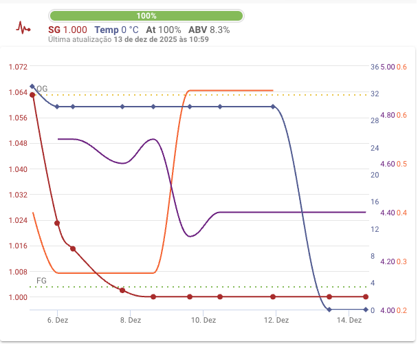

### 🍺 A cerveja - Brisa

A cerveja alvo desta brassagem é uma *Saison* um estilo belga que possuei várias cervejas famosos represenantes do estilo como a cerveja **Saison Dupont**. 

Está é mais uma brassagem ligado ao nosso grupo BINGO. Desta vez o estilo foi escolha do Hendy.

De acordo com o [BJCP de 2021](https://bjcp-brasil.github.io/bjcp-2021-pt-br/), temos que uma *Saison deve ser:

> Uma família de ales belgas refrescantes, altamente atenuadas, lupuladas e razoavelmente amargas, com final muito seco e carbonatação alta. Caracterizadas por um perfil de fermentação frutado, condimentado e às vezes fenólico, com uso de cereais e às vezes condimentos/especiarias para complexidade. Existe muita variação de teor alcoólico e de cor.

A seguir vejam a composição de malte que eu utilizei nessa receita:

---

### 🌾 Fermentáveis

| Fermentável | Quantidade | %       |
| ----------- | ---------- | ------- |
| Pilsen Malt | 4,50 kg    | 81,82 % |
| Munich Malt | 0,70 kg    | 12,73 % |
| CaraHell    | 0,30 kg    | 5,45 %  |

Total de grãos/extratos: **5.5 kg**

Aqui um detalhe, importante. Usei a lavagem dos grãos da Belgian Strong Golden Ale como água de mostura. Por esa razão pude usar poucos grãoa.

### 🔥 Perfil de mostura 

| Etapa             | Temperatura | Duração |
| ----------------- | ----------- | ------- |
| Mostura principal | 67 °C       | 60 min  |
| Mash-out          | 78 °C       | 10 min  |

### 🌿 Lupulagem (boil steps / adições) e 🫚 Especiarias

| Lúpulo               | Quantidade | Tempo  |
| -------------------- | ---------- | ------ |
| Hallertau Mittelfrüh | 25 g       | 60 min |
| Hallertau Mittelfrüh | 20 g       | 15 min |
| Hallertau Mittelfrüh | 20 g       | 5 min  |
| Semente de coentro   | 15 g       | 0 min  |
| Erva doce            | 44g        | 0 min  |

Lupulagem simples. Somente para acertar o amargor.
Adicionei também erva doce e semente de coentro porque são duas especiaria que eu gosto.

### 🌡️ Perfil de fermentação

| Etapa         | Temperatura | Duração |
| ------------- | ----------- | ------- |
| Inoculação e Fermentação em temperatura ambiente    | 30+ °C       | 7 dias       |

### 🧬 Levedura

* **Nome:** FermoAle D'la Grange.
* **Quantidade usada no lote:** 1 pacote 
* **Attenuation (informada):** \~83%
* **Temperatura mínima/máxima indicada:** \~16–24 °C.&#x20;

### ⚖️ Comparativo: Estimado (receita) × Medido (lote)

| Parâmetro | Estimado | Medido |
| --------- | -------- | ------ |
| OG        | 1.048    | 1.063  |
| FG        | 1.003    | 1.000  |
| ABV       | 5,9%     | 8,3%   |
| IBU       | 20       | 14     |
| EBC       | 7,3      | 6,1    |

### 📝 Notas de produção

### Mostura

O uso da lavagem da Belgian Strong Golden Ale produziu um mosto mais rico em açucar do que o esperado.

#### Lavagem

O volulme prá fervura foi bem mais alto do que o esperado e com 7 pontos a mais de gravidade.

#### Fervura

A fervura ocorreu normalmente e o volume evaporado foi de acordo como esperado.

Ao final do da fervura, no flameout adicionei as especiarias, cerca de 2g/l de erva doce e 15 g de semente de coentro.

#### Fermentação

Resolvi ousar nessa cerveja, fermentei no postmix em temperatura ambiente e com pressurização.

_A linha azul escuro é a temperatura do fermentador. A linha vermelha é a OG medida via referatômetro já corrigida e a linha laranja é a pressão no fermentador. 
As medidas de densidade não estão corretas devido aos erros citados anteriormente._

### 🍺 A cerveja no copo

Antes da maturação, quando fui purgar a levedura, cheguei a provar a cerveja e ela já tinha um aroma e sabor muito forte de semente de coentro. Bem ruim para ser sincero, mas com o passar do tempo foi se esvaindo.

Aguardando a avaliação oficial.

A cerveja não está carbonatada da forma que eu gosto, mas o postmix em que ela esta armazenada está com problema de vazamento. No mais, ficou um cor bonita, o aroma de semente de coentro está mais controlado e melhor. Não encontrei expressão da levedura, tudo indica que o motivo foi a fermentação sobre pressão. O sabor da erva doce aparece para mim no retrogosto. Ficou intessante, mas acho que não ficou com sabor de um saison, faltou expressão da levedura.

<!--
### Pontos a melhorar

- [x] Corrigir um pouco a cor, para buscar algo mais claro
- [x] Aumentar um pouco o amargor da receita
- [ ] Revisitar parâmetros
-->
