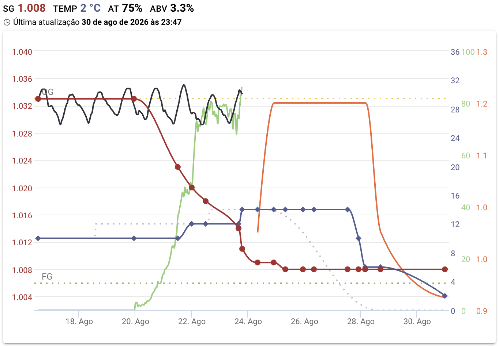

### 🍺 A cerveja - Faceira

A cerveja alvo desta brassagem é uma *German Leichtbier*, que batizei de Faceira. Ela tem um objetivo bem prático: servir de propagação para a levedura que eu vou usar em uma Bohemian Pilsner (a *Czech Premium Pale Lager* do novo BJCP). Ou seja, é uma cerveja de baixo teor alcoólico que me entrega uma lama de lager saudável pra próxima receita — e, de quebra, uma cerveja bem fácil de beber.

De acordo com o [BJCP de 2021](https://bjcp-brasil.github.io/bjcp-2021-pt-br/), temos que uma *German Leichtbier* deve ser:

>  Uma lager alemã clara, altamente atenuada, com corpo leve e com menos teor alcoólico e calorias que outras cervejas de teor alcoólico padrão. Moderadamente amarga com sabores perceptíveis de malte e lúpulo e, ainda sim, é uma cerveja interessante de beber.

A seguir vejam a composição de malte que eu utilizei nessa receita:

---

### 🌾 Fermentáveis

| Nome                  | Quantidade | % na receita |
| --------------------- | ---------: | -----------: |
| Malte Pilsen          |     4,2 kg |       95,45% |
| Malte de Trigo Claro  |     0,2 kg |        4,55% |

Total de grãos/extratos: **4,4 kg**

### 🔥 Perfil de mostura

| Etapa / Nome da mostura | Temperatura | Duração |
| ----------------------- | ----------: | ------: |
| Sacarificação           |       66 °C |  60 min |
| Mash Out                |       75 °C |  10 min |

Infusão simples, com sacarificação baixa (66 °C) pra buscar a alta fermentabilidade que o estilo pede — a Leichtbier precisa ficar seca e leve de corpo. A correção de água foi feita com gypsum (4,3 g), cloreto de cálcio (3,5 g) e sal de epsom (4,2 g).

### 🌿 Lupulagem (boil steps / adições) e 🫚 Especiarias

| Nome                      | Quantidade | Tempo de adição |
| ------------------------- | ---------- | --------------- |
| Hallertau Blanc (8,7% AA) | 15 g       | 55 min          |
| Hallertau Blanc (8,7% AA) | 15 g       | 30 min          |
| Hallertau Blanc (8,7% AA) | 20 g       | 0 min (whirlpool) |

Lupulagem inteira em Hallertau Blanc, dividida entre amargor, sabor e uma adição de whirlpool.

### 🌡️ Perfil de fermentação

| Etapa                | Temperatura | Duração |
| -------------------- | ----------- | ------- |
| Fermentação          | 10 °C       | 2 dias  |
| Fermentação          | 14 °C       | 4 dias  |
| Descanso do diacetil | 16 °C       | 2 dia   |
| Cold Crash           | 0 °C        | 10 dias  |

### 🧬 Levedura

* **Nome:** Czech Pils (TeckBrew 86) — líquida.
* **Laboratório:** Levteck
* **Quantidade usada no lote:** Starter de 2.5L iniciado a partir de um tubo falcon
* **Attenuation (informada):** \~74%
* **Temperatura mínima/máxima indicada:** \~10–14 °C.&#x20;

### ⚖️ Comparativo: Estimado (receita) × Medido (lote)

| Parâmetro | Estimado | Medido |
| --------- | -------- | ------ |
| OG        | 1.030    | 1.033  |
| FG        | 1.006    | 1.008  |
| ABV       | 3,15%    | 3,3%   |
| IBU       | 21       | 21     |
| EBC       | 4,9      | 4,9    |

### 📝 Notas de produção

#### Mostura

Aferi o pH da água logo depois da correção de sais e ele estava em 6.5. Com 25 minutos de mostura medi de novo e já estava em 5.12, confirmando direitinho o efeito do malte na acidificação.

Sinto que finalmente estou dominando a bomba e a influência dela no controle de temperatura — a rampa toda ocorreu como o esperado. A única dificuldade foi chegar na temperatura de mash out. Desconfio que o sensor estava longe demais da saída da bomba e isso atrapalhou a medição, apesar de eu achar que isso não deveria ser um problema.

Densidade pré-lavagem: 19.5 °P.

<figure style="margin: auto">
	
	<figcaption>Poucos grãos na panela, como manda um estilo de baixo ABV</figcaption>
</figure>

#### Lavagem

O volume pré-fervura passou um pouco, 1L a mais do que o planejado. A densidade pré-fervura também veio acima do esperado: 1.029, ou 7,4 °P.

#### Fervura

Fervura de 60 minutos, sem alteração no tempo. O volume pós-fervura ficou em 37L, sem considerar a contração pelo resfriamento.

Adicionei o lúpulo de whirlpool a 96 graus. Como não usei chiller, o resfriamento foi na base de água por fora da panela e um whirlpool mais longo: demorou quase 10 minutos pra baixar até 85 graus e quase 14 minutos pra chegar em 80 graus.

A OG medida no fim ficou em 1.033, um pouco acima do que a receita previa.

<figure style="margin: auto">
	
	<figcaption>Adição de lúpulo durante a fervura</figcaption>
</figure>

<figure style="margin: auto">
	
	<figcaption>Adição de lúpulo no whirlpool</figcaption>
</figure>

<figure style="margin: auto">
	
	<figcaption>Cor do mosto no fim da brassagem</figcaption>
</figure>

#### Fermentação

A fermentação começou com a Czech Pils da Levteck, seguindo o plano de inocular baixo, a 10 graus, e subir aos poucos até o descanso do diacetil. Como o objetivo desta brassagem é justamente propagar essa levedura pra Bohemian Pilsner, o que mais me interessa aqui é chegar no fim com uma lama saudável e farta.

A fermentação começou errada. Infelizmente a levedura da Bohemian Pilsner não sobreviveu ao inóculo. Acredito que a propagação tenha dado errado e eu não percebi. Com alguma urgência propaguei a BF-16 da Angel Yeast. Adicionei com pelo menos 48 horas de atraso. Daí em diante a fermentação foi normal.

<figure style="margin: auto">
	
	<figcaption>Gráfico da fermentação. A linha vermelha é a densidade medida via refratômetro já corrigida, a linha azul escuro é a temperatura do fermentador, a linha verde clara é a medição de bolhas por minuto do Plaato, a linha preta é a densidade medida pelo Plaato e a linha laranja é a pressão no fermentador. Percebam que a densidade fica parada até o dia 20, quando a nova levedura entra em ação.</figcaption>
</figure>

### 🍺 A cerveja no copo

A cerveja ficou pronta. Apesar do tempo de armazenamento em Postmix ela não clarificou bem como eu esperava.
No início achei que ela tinha ficado com um sulfuroso desagradável, mas pelo jeito o tempo resolveu esse problema.
Me parece sem off-flavour. Entretanto, talvez por ter usado somente malte pilsen Agrária, que é bem neutro, achei
que faltou personalidade pra essa cerveja. Nem mesmo o lúpulo usado chegou a sobressair.

Por esse motivo, separei uma parte do lote e adicionei grãos de café inteiros de torra média diretamente no postmix.
Depois de uma semana, o café já estava bem presente.

### Pontos a melhorar

- [ ] Da próxima vez usar um malte pilsen com mais personalidade ou adicionar algum malte especial para compensar a neutralidade do malte pilsen.
