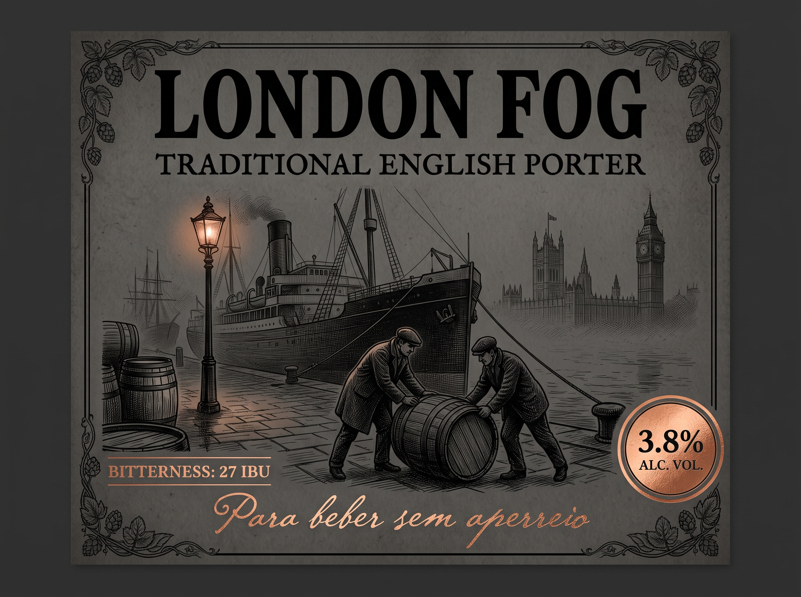
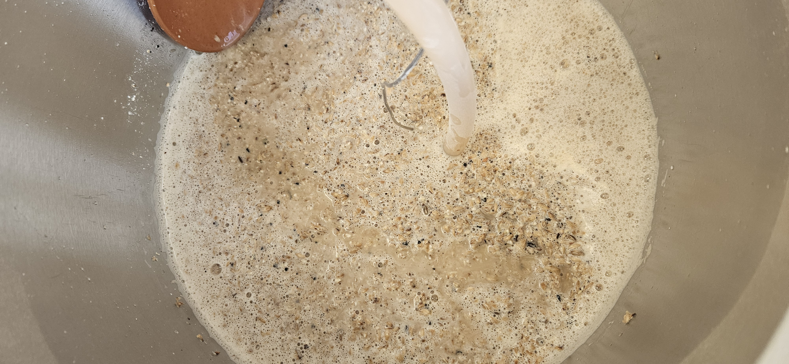
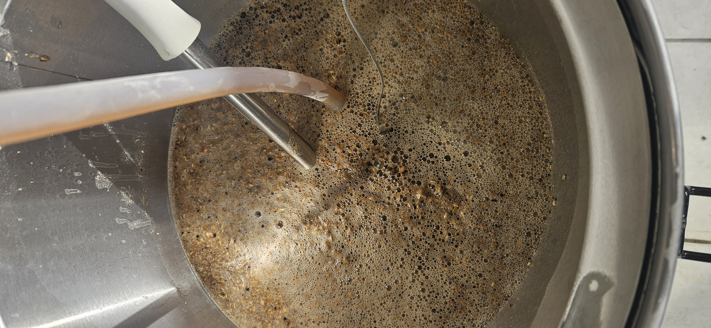
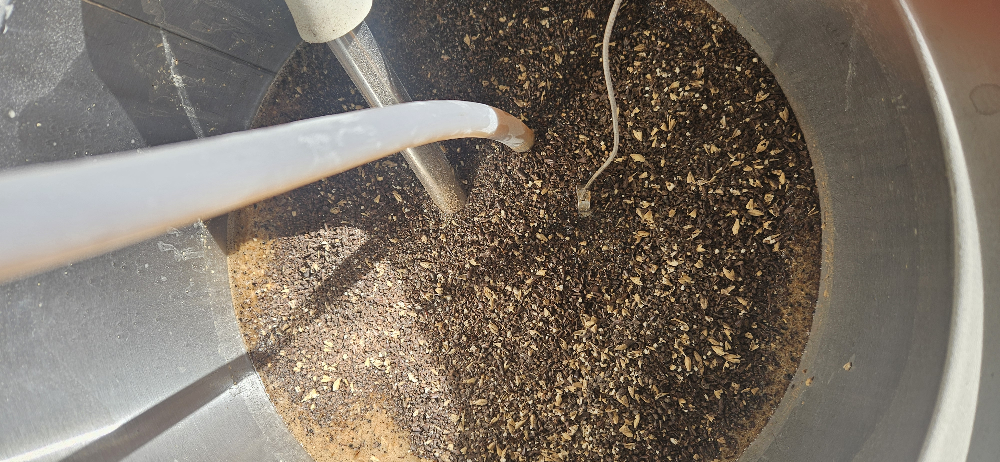
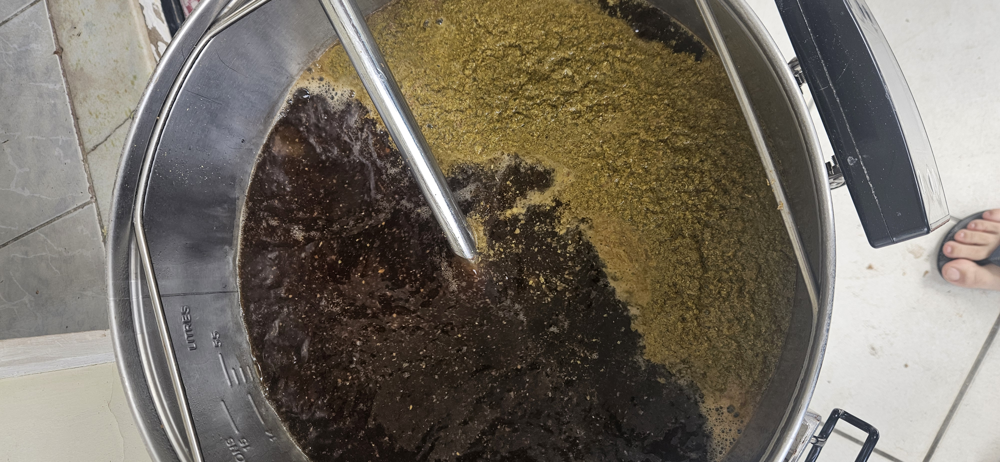
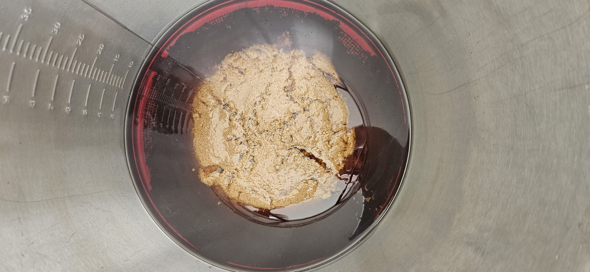
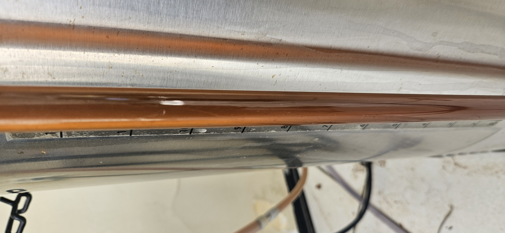

### 🍺 A cerveja - London Fog

A cerveja alvo desta brassagem é uma *English Porter*, que batizei de London Fog. Está é mais uma brassagem ligado ao nosso grupo BINGO. Desta vez o estilo foi escolha do **Hendy**.

De acordo com o [BJCP de 2021](https://bjcp-brasil.github.io/bjcp-2021-pt-br/), temos que uma *English Porter* deve ser:

>  Uma cerveja inglesa marrom escura, de teor alcoólico moderado, com um caráter amargo e torrado contido. Pode ter uma variedade de sabores torrados, geralmente sem qualidades de queimado e muitas vezes tem um perfil maltado de chocolate e caramelo.

A seguir vejam a composição de malte que eu utilizei nessa receita:

---

### 🌾 Fermentáveis

| Nome                               | Quantidade | % na receita |
| ---------------------------------- | ---------: | -----------: |
| Munich Malt - El Guardián Poderoso |     3,7 kg |       40,22% |
| Finest Maris Otter® Ale Malt       |       3 kg |       32,61% |
| Pale Malt - Alto en el Cielo       |     1,5 kg |       16,30% |
| Biscuit                            |     0,5 kg |        5,43% |
| BlackSwaen Chocolate B             |     0,5 kg |        5,43% |

Total de grãos/extratos: **9,2 kg**

### 🔥 Perfil de mostura

| Etapa / Nome da mostura | Temperatura | Duração |
| ----------------------- | ----------: | ------: |
| Sacarificação           |       65 °C |  60 min |
| Mash Out                |       78 °C |  10 min |

Infusão simples, com os maltes escuros ficando de fora da sacarificação: eles só entraram na panela durante o mash out (*capped mash*).

### 🌿 Lupulagem (boil steps / adições) e 🫚 Especiarias

| Nome                 | Quantidade | Tempo de adição |
| -------------------- | ---------- | --------------- |
| Challenger (8,4% AA) | 50 g       | 55 min          |
| Whirlfloc            | 2 items    | 10 min          |

Fora do planejado, entraram mais 8 g de Magnum faltando 28 minutos para o fim da fervura — explico o motivo nas notas de produção.

### 🌡️ Perfil de fermentação

| Etapa                | Temperatura | Duração |
| -------------------- | ----------- | ------- |
| Fermentação          | 18 °C       | 4 dias  |
| Descanso do diacetil | 21 °C       | 2 dias  |
| Cold Crash           | 10 °C       | 1 dia   |
| Cold Crash           | 4 °C        | 10 dias |

### 🧬 Levedura

* **Nome:** Residente Ale.
* **Laboratório:** Levteck
* **Quantidade usada no lote:** 1 pkg que foi progapado. No total usei um starer de 2.5L .
* **Attenuation (informada):** \~73-75%
* **Temperatura mínima/máxima indicada:** \~16–22 °C.

### ⚖️ Comparativo: Estimado (receita) × Medido (lote)

| Parâmetro | Estimado | Medido |
| --------- | -------- | ------ |
| OG        | 1.042    | 1.045  |
| FG        | 1.013    | —      |
| ABV       | 3,81%    | —      |
| IBU       | 27       | —      |
| EBC       | 23,0     | —      |

### 📝 Notas de produção

A brassagem de hoje aconteceu em um ritmo fora do usual. Em geral faço as minhas brassagens aos sábados, mas estive bastante atarefado.

#### Mostura

Não atualizei o estoque antes de brassar, e isso acabou tomando muito tempo durante a mostura. Resultado: esqueci de medir o pH no início, e só perto do final da sacarificação é que fui medir a densidade. Ao final da mostura, antes do mash out, medi 1.067.

Os maltes escuros eu adicionei só durante o mash out. O pH depois dessa adição ficou em 5.23, bem próximo do estimado pelo BrewFather.

<figure style="margin: auto">
	
	<figcaption>Início da mostura</figcaption>
</figure>

<figure style="margin: auto">
	
	<figcaption>Fim da mostura</figcaption>
</figure>

<figure style="margin: auto">
	
	<figcaption>Capped mash: adicionando os maltes escuros</figcaption>
</figure>

#### Lavagem

O volume pré-fervura foi de 50 litros, um a mais que o estimado. Para minha surpresa, a densidade pré-fervura veio bem mais alta que o estimado: medi 11.4 Brix.

#### Fervura

Para tentar alcançar o equilíbrio previsto pelo BrewFather, adicionei 3L de água e medi 10.9 Brix. Então adicionei mais 2.8L e a densidade caiu para 10.3 Brix, isso já passados quase 30 minutos de fervura.

Para manter a relação BU/GU, adicionei mais 8 gramas de Magnum, faltando 28 minutos para o fim da fervura, buscando os 4 IBU que faltavam.

Ao fim dos 20 minutos de whirlpool a temperatura estava em 88 graus. Talvez a cerveja fique mais amarga do que o planejado, por conta dessas 8 gramas adicionadas no meio da fervura, que continuaram isomerizando durante o whirlpool.

A densidade ao fim da fervura ficou em 11.3 Brix, e sobraram 1.6L de trub.

<figure style="margin: auto">
	
	<figcaption>Adição de lúpulo na fervura</figcaption>
</figure>

<figure style="margin: auto">
	
	<figcaption>Resultado do whirlpool</figcaption>
</figure>

<figure style="margin: auto">
	
	<figcaption>Cor do mosto no fim da fervura</figcaption>
</figure>

#### Fermentação

Em breve trago atualizações.

### 🍺 A cerveja no copo

Em breve trago atualizações.

### Pontos a melhorar

- [ ] Atualizar o estoque antes do dia da brassagem, para não perder tempo (e medições) durante a mostura
